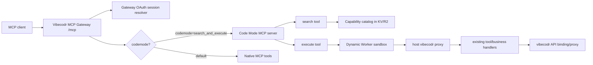

# Cloudflare Codemode MCP Migration Plan

Last reviewed: 2026-04-24

## Research Summary

Cloudflare's token savings come from changing what the model sees, not from compressing the same tool list.

The Cloudflare API MCP server exposes only two tools, `search` and `execute`, while keeping the full API surface behind server-side code execution. Cloudflare documents the full API case as 2,594 native MCP tools and roughly 1,170,000 tokens with full schemas, versus roughly 1,000 tokens in Code Mode. Their docs describe generated code running inside an isolated Dynamic Worker sandbox, with host-side request handling keeping authentication out of the sandbox.

Cloudflare's MCP portal version uses the same pattern across upstream MCP servers: a `search` tool lets the model inspect tool definitions on demand, and an `execute` tool exposes typed `codemode.*` methods inside an isolated Dynamic Worker.

Primary sources:
- https://blog.cloudflare.com/code-mode-mcp/
- https://developers.cloudflare.com/agents/api-reference/codemode/
- https://developers.cloudflare.com/changelog/post/2026-03-26-mcp-portal-code-mode/
- https://github.com/cloudflare/mcp
- https://blog.cloudflare.com/enterprise-mcp/
- https://developers.cloudflare.com/agents/api-reference/mcp-handler-api/
- https://developers.cloudflare.com/agents/model-context-protocol/transport/

## Current Vibecodr Baseline

After removing the widget surface and reshaping default discovery around product workflows, Vibecodr now exposes 30 public MCP tools by default while keeping 38 total handlers available for compatibility and recovery. Local measurement from `npm run mcp:measure` on 2026-04-24:

- default public tool count: 30
- default public listed JSON size: 27,645 bytes
- default public rough token estimate: 6,912 tokens
- default public tools with output schemas: 70,421 bytes / 17,606 rough tokens
- all native handler count: 38
- all native handlers with output schemas: 94,521 bytes / 23,631 rough tokens
- Code Mode descriptor count: 2
- Code Mode descriptor size: 1,773 bytes / 444 rough tokens
- capability catalog count: 47
- capability catalog size: 115,106 bytes / 28,777 rough tokens

That means Cloudflare-style Code Mode will still help, but the first win is not as dramatic as Cloudflare's 2,594-tool API case. The strategic win is future-proofing: Vibecodr can add lower-level draft, publish, storage, pulse, analytics, and profile operations behind search/execute without loading every schema into the model context.

## Target Shape

Expose a small opt-in Code Mode MCP surface:

1. `search`
   - Input: JavaScript async arrow function.
   - Runtime: isolated Dynamic Worker with read-only access to a server-side Vibecodr capability catalog.
   - Purpose: discover relevant capabilities, schemas, constraints, scopes, and workflow recipes without loading all of them into context.

2. `execute`
   - Input: JavaScript async arrow function plus optional confirmation/account context fields.
   - Runtime: isolated Dynamic Worker with a typed `vibecodr` proxy.
   - Purpose: call host-owned operations, chain multiple steps, filter responses, and return only the data the agent needs.

Keep the current native surface as the compatibility/default surface while opt-in behavior is evaluated:

- `POST /mcp` exposes the current individual product-shaped tools.
- `POST /mcp?codemode=search_and_execute` exposes the Code Mode `search` and `execute` tools.
- Default `/mcp` can become Code Mode only after evals prove parity and client compatibility.

This follows Cloudflare's portal connection shape for `?codemode=search_and_execute` while keeping Vibecodr's native path stable during rollout.

## Architecture



## Phase 1: Catalog And Measurement

Create a server-side capability catalog generated from the current tool registry.

Catalog fields:
- stable capability id
- short title and purpose
- read/write/destructive/idempotent flags
- required auth scopes
- input schema
- output summary shape
- examples
- preferred workflow ordering
- confirmation requirements
- owner handler name

Implementation:
- Add `src/mcp/capabilityCatalog.ts`.
- Generate catalog from existing `getTools({ includeOutputSchema: true, includeHidden: true })` plus manual workflow notes.
- Add `scripts/measure-mcp-token-surface.mjs` that reports native tool bytes/tokens and Code Mode descriptor bytes/tokens.
- Store a built catalog snapshot in KV/R2 only if runtime generation becomes too expensive; otherwise generate per deploy.

Acceptance:
- Snapshot test proves all existing tools appear in the catalog.
- Measurement test records current native size and target Code Mode descriptor size.

## Phase 2: SDK-Aligned Server Adapter

Move the internal MCP tool registration toward Cloudflare's SDK shape without changing behavior yet.

Implementation:
- Introduce `createVibecodrMcpServer(options)` returning a request-bound adapter with an SDK `McpServer`.
- Register native and Code Mode tools through the SDK server, delegating to the existing `callTool` / `callCodeModeTool` implementations.
- Keep the existing hardened gateway route as the HTTP transport while the adapter owns tools, prompts, resources, auth classification, and tool calls.
- Preserve the current OAuth gateway, auth challenge metadata, rate limits, telemetry, and transport regression tests.

Reason:
- Cloudflare's `codeMcpServer` and `openApiMcpServer` operate on SDK MCP servers/specs.
- This adapter is the clean bridge from today's custom handler to Code Mode without rewriting business logic.

Acceptance:
- `npm run check`
- `npm test`
- `npm run transport:regression`
- default native `tools/list` remains intentionally minimized; hidden compatibility handlers remain callable by exact name until Code Mode owns recovery/catalog execution.

## Phase 3: Search Tool

Add Code Mode search as an opt-in route first: `/mcp?codemode=search_and_execute`.

Implementation:
- Add `search` tool that executes code against `catalog`, not against secrets or live APIs.
- Use Cloudflare Dynamic Worker Loader if available in the account, matching Cloudflare's public MCP server pattern.
- Fallback for local tests: deterministic in-process evaluator behind `NODE_ENV=test` only, with no production flag.
- Return truncated, structured results with a max byte budget.

Safety rules:
- No network access from search sandbox.
- No secrets, tokens, env vars, or user-specific data in catalog.
- Timeout and output limits on every search call.

Acceptance:
- Search can find quick publish, live vibe, metadata update, pulse guidance, and recovery capabilities.
- Search cannot access env vars or fetch arbitrary URLs.

## Phase 4: Execute Tool

Add `execute` with a typed host proxy. Do not expose Vibecodr tokens to generated code.

Sandbox API:

```ts
declare const vibecodr: {
  call<T = unknown>(capability: string, input: unknown): Promise<T>;
};
```

Host behavior:
- Resolve the MCP session in the gateway before sandbox execution.
- Inject only a capability caller, never raw credentials.
- Route `vibecodr.call()` to existing business handlers.
- Enforce the same auth, rate limit, mutability, confirmation, payload-size, thumbnail, and visibility constraints as native tools.
- Apply per-capability allowlists for read-only versus mutating actions.
- Support exact `capabilityId` discovery so the model can fetch schema/examples only when needed instead of loading every native tool schema up front.
- Keep top-level `query`, `capabilityId`, `arguments`, and `confirmed` behavior consistent between Dynamic Worker execution and the local fallback.

Mutation controls:
- Read-only capabilities can run freely after auth.
- Mutating capabilities require explicit confirmation evidence in the `execute` input or a prior user-confirmed MCP call.
- Destructive actions remain individually auditable in telemetry even if they happen inside one `execute` call.
- Native destructive tools also enforce `confirmed: true`; Code Mode is not the only safety layer.

Acceptance:
- Execute can reproduce the current guided publish happy path using `quick_publish_creation`.
- Execute can chain `list_my_live_vibes` -> `get_live_vibe` -> `get_vibe_share_link`.
- Execute rejects unknown capabilities, missing auth, missing confirmation, oversize output, and sandbox network attempts.

## Phase 5: Default Rollout

Ship Code Mode behind a feature flag, then make it default.

Flags:
- `CODEMODE_ENABLED=false` initially.
- `CODEMODE_DEFAULT=false` initially.
- `CODEMODE_REQUIRE_DYNAMIC_WORKER=true` in production.
- `CODEMODE_ALLOW_NATIVE_FALLBACK=false` in deployed environments; local/CI tests can opt in explicitly.

Rollout:
1. Local and CI only.
2. Staging Worker with `/mcp?codemode=search_and_execute`.
3. Production opt-in URL for dogfood clients.
4. Default `/mcp` switches to Code Mode.
5. Native tool surface remains available only through `?codemode=false` for debugging.

Acceptance:
- Existing remote MCP clients can still complete OAuth.
- Token surface measurement shows a fixed small Code Mode descriptor.
- Observability can identify search calls, execute calls, nested capability calls, failures, and mutating operations.

## Phase 6: Expand The Hidden Catalog

Once the two-tool surface is stable, add lower-level Vibecodr operations behind the catalog instead of adding more public MCP tools.

Candidates:
- draft browsing and draft metadata operations
- live vibe metadata variants
- pulse guidance and pulse setup operations
- storage asset inspection and upload helpers
- analytics and engagement reads
- import recovery and repair actions

Rule:
- New low-level capabilities go into the hidden catalog first.
- Add a native MCP tool only when it is a durable product-level primitive that should stay visible to all clients.

## Risks And Guardrails

- Prompt injection through returned API data: keep generated code sandboxed, truncate outputs, and treat nested tool results as data.
- Overpowered execute tool: enforce host-side capability allowlists and confirmation gates.
- Hidden auth leaks: credentials stay in the host proxy; generated code receives no bearer token, no refresh token, no Clerk token.
- Dynamic Worker scope creep: the Worker Loader binding must be named and treated as Code Mode-only, with `globalOutbound: null`, no direct platform bindings, and short limits. See [`dynamic-worker-sandbox-configuration.md`](./dynamic-worker-sandbox-configuration.md).
- Debuggability loss: telemetry must log each nested capability call with the outer `execute` trace id.
- Client compatibility: keep `?codemode=false` until major clients confirm Code Mode behavior is stable.
- Cloudflare beta churn: isolate Codemode/Dynamic Worker code behind adapter modules so package/API changes do not touch business handlers.

## Implementation Status

Implemented locally:

1. Added `src/mcp/capabilityCatalog.ts` from the current native tools plus lane-shaped catalog entries.
2. Added `scripts/measure-mcp-token-surface.mjs` and `npm run mcp:measure`.
3. Added tests proving the catalog covers every native tool and contains future publish/runtime/pulse/social/ops entries.
4. Added opt-in `/mcp?codemode=search_and_execute` with `search` and `execute`.
5. Added production Code Mode config defaults that require a Dynamic Worker loader and fail closed when it is missing.
6. Added a lazy `@cloudflare/codemode` adapter that constructs `DynamicWorkerExecutor` with `globalOutbound: null`, explicit timeout, output/log caps, and nested capability call limits.
7. Kept the deterministic in-process catalog interpreter only as an explicit fallback path for local/CI-style tests and disabled production fallback by deployment config.
8. Added `src/mcp/server.ts`, an SDK-aligned MCP adapter that registers the native surface, Code Mode surface, prompts, and empty resource policy through `McpServer` while preserving the existing request-bound OAuth/session/telemetry gateway.
9. Wired `src/mcp/handler.ts` through the adapter for `tools/list`, `tools/call`, `prompts/list`, `prompts/get`, `resources/list`, and `resources/read`.
10. Added `npm run codemode:live-sandbox` as the staged live Worker regression harness and `npm run verify:release` as the combined local-plus-staged release gate.
11. Added initialization instructions for zero-context clients.
12. Added exact Code Mode capability detail results with schemas/examples and explicit `catalog_only` execution status.
13. Enforced `confirmed: true` on destructive native handlers before side effects begin.

Remaining rollout work: provision `CODEMODE_WORKER_LOADER` in the Cloudflare account, enable `CODEMODE_ENABLED` in staging first, and run `npm run verify:release` with `MCP_BASE_URL` pointed at that staged URL before any production default change.
