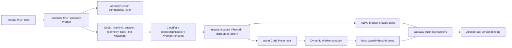

# Cloudflare MCP Production Architecture Implementation Plan

> **For agentic workers:** REQUIRED SUB-SKILL: Use superpowers:subagent-driven-development (recommended) or superpowers:executing-plans to implement this plan task-by-task. Steps use checkbox (`- [ ]`) syntax for tracking.

**Goal:** Move the Vibecodr MCP gateway toward Cloudflare's 2026 official MCP stack without weakening Vibecodr's OAuth, session, confirmation, observability, public tool-shape, or Code Mode safety boundaries.

**Architecture:** Keep the current custom gateway as the production baseline while extracting a request-scoped MCP server factory and proving parity against Cloudflare's `createMcpHandler` / `WorkerTransport` path. Adopt `McpAgent` only if a future requirement genuinely needs persisted MCP session state, Agent state APIs, elicitation/sampling, or legacy SSE.

**Tech Stack:** Cloudflare Workers, `@modelcontextprotocol/sdk`, Cloudflare Agents SDK `agents/mcp`, `@cloudflare/codemode`, Dynamic Workers, Clerk-backed OAuth compatibility, `OPERATIONS_KV`, `AUTH_CODE_COORDINATOR`, Cloudflare rate-limit bindings, service binding to `vibecodr-api`.

---

## Research Baseline

Last reviewed: 2026-04-24

Cloudflare's current MCP guidance is not one API. It is a set of production patterns:

- `createMcpHandler` is the recommended Streamable HTTP handler for stateless remote MCP servers in plain Workers.
- `WorkerTransport` is Cloudflare's MCP transport implementation for HTTP request/response, SSE streaming, session management, CORS, and optional persistent transport state.
- `McpAgent` is for stateful MCP servers that need Agent state, per-session Durable Object behavior, hibernation, elicitation/sampling, or legacy SSE support.
- Cloudflare's transport docs say Streamable HTTP is the production remote-MCP standard, RPC is for internal Cloudflare agents, and SSE is deprecated except for legacy compatibility.
- Cloudflare's Code Mode path is useful for large tool surfaces and multi-step orchestration, but the docs mark it experimental/beta and state that tool approval (`needsApproval`) is not supported yet.
- Cloudflare MCP portals are governance infrastructure for enterprise policy, audit, DLP routing, and tool scoping. They are not a replacement for Vibecodr's public product gateway.

Primary sources:

- https://developers.cloudflare.com/agents/api-reference/mcp-handler-api/
- https://developers.cloudflare.com/agents/model-context-protocol/transport/
- https://developers.cloudflare.com/agents/api-reference/mcp-agent-api/
- https://developers.cloudflare.com/agents/model-context-protocol/authorization/
- https://developers.cloudflare.com/agents/api-reference/codemode/
- https://blog.cloudflare.com/code-mode-mcp/
- https://github.com/cloudflare/mcp
- https://developers.cloudflare.com/cloudflare-one/access-controls/ai-controls/mcp-portals/
- https://developers.cloudflare.com/agents/model-context-protocol/governance/

## Current Vibecodr Baseline

Current implementation shape:

- `src/worker.ts` exports a normal Worker `fetch` handler and builds the app handler from Cloudflare bindings.
- `src/app.ts` owns routing and sends `POST /mcp` to `handleMcpRequest(...)`.
- `src/mcp/handler.ts` manually handles JSON-RPC parsing, initialize negotiation, batching, notifications, auth challenges, tool calls, prompts, resources, telemetry, and response envelopes.
- `src/mcp/server.ts` already creates a request-bound SDK `McpServer` adapter with native and Code Mode tool registration.
- `package.json` currently depends on `@modelcontextprotocol/sdk` and `@cloudflare/codemode`, but not `agents`.
- `deploy/cloudflare/wrangler.gateway.toml.example` uses `OPERATIONS_KV`, `AUTH_CODE_COORDINATOR`, service binding `VIBE_API`, Cloudflare rate-limit bindings, and optional `CODEMODE_WORKER_LOADER`.

This gateway is already production-shaped in the areas that matter most to remote clients:

- single Streamable HTTP MCP endpoint at `/mcp`
- generic MCP OAuth compatibility endpoints
- protected-resource metadata
- gateway-issued bearer and refresh tokens
- Clerk as upstream identity
- session revocation
- `mcp-session-id` CORS allow/expose behavior
- hidden compatibility/recovery handlers
- product-shaped default `tools/list`
- server-side `confirmed: true` enforcement for destructive native handlers
- opt-in Code Mode route at `/mcp?codemode=search_and_execute`

The remaining production architecture work is to reduce long-term protocol ownership by moving transport mechanics onto Cloudflare's official handler without giving up Vibecodr-owned auth, tool policy, telemetry, and safety behavior.

## Non-Negotiable Invariants

These must hold through every phase:

- No raw Clerk tokens, Vibecodr bearer tokens, refresh tokens, cookies, authorization headers, raw package bodies, or user code bundles may be exposed to model-visible content, Code Mode generated code, logs, telemetry, or structured tool errors.
- OAuth discovery, dynamic registration, preregistered public-client support, redirect validation, PKCE validation, refresh rotation, and token revocation must remain compatible with generic remote MCP clients.
- Protected MCP tool calls must reject revoked sessions.
- Destructive tools must enforce `confirmed: true` server-side before side effects begin.
- Default `/mcp` must remain client-neutral and product-shaped until a measured, staged, reversible default-Code-Mode rollout is complete.
- Hidden recovery handlers may stay callable by exact name for compatibility, tests, diagnostics, and Code Mode execution, but they must not reappear in default `tools/list`.
- `/widget` must remain unavailable unless there is a fresh product/security decision.
- `resources/list` must remain empty unless there is a fresh product/security decision.
- `mcp-session-id` must remain readable by approved browser-based MCP clients through CORS.
- The gateway must continue to prefer Cloudflare service bindings and platform bindings over public network hops when deployed on Cloudflare.
- `CODEMODE_WORKER_LOADER` must remain a dedicated Code Mode sandbox binding, not a general user-code runtime.
- Production Code Mode must fail closed when Dynamic Worker execution is required and the loader binding is unavailable.

## Target Architecture



The target is not "everything in `McpAgent`." The target is:

1. Vibecodr-owned HTTP/auth/security wrapper.
2. Cloudflare-owned Streamable HTTP transport mechanics.
3. Request-scoped `McpServer` registration.
4. Existing product/tool policy preserved.
5. Code Mode gated behind deployment, sandbox, and eval proofs.

## Phase 0: Freeze The Existing Production Contract

**Purpose:** Make the current behavior explicit enough that the transport migration cannot accidentally change it.

**Files:**

- Modify: `scripts/mcp-transport-regression.mjs`
- Modify: `scripts/security-regression.mjs`
- Modify: `test/worker.test.ts`
- Modify: `test/mcpToolSurface.test.ts`
- Modify: `docs/mcp-server.md`

- [ ] **Step 1: Add a transport contract checklist to `scripts/mcp-transport-regression.mjs`.**

Add or confirm assertions for:

- `POST /mcp` accepts `initialize`.
- `GET /mcp` returns method-not-allowed behavior expected by remote MCP clients.
- `initialize` returns server instructions, tools capability, prompts capability, and no resources capability.
- initialize response exposes `mcp-session-id`.
- CORS preflight allows `mcp-session-id`.
- actual MCP responses expose `mcp-session-id`.
- `tools/list` includes the 30 public native tools.
- `tools/list` excludes hidden recovery handlers.
- `resources/list` returns `[]`.
- `resources/read` rejects unknown widget resources.
- batch requests preserve response order and trace behavior.
- notifications receive accepted/no-content behavior.

- [ ] **Step 2: Add an auth/security checklist to `scripts/security-regression.mjs`.**

Add or confirm assertions for:

- revoked session cannot call a protected tool.
- no OAuth/token exchange failure exposes raw upstream HTML or body text.
- `WWW-Authenticate` challenge includes protected-resource metadata.
- dynamic client redirect URI must match registration exactly.
- preregistered loopback redirect may vary only by port.
- refresh replay returns the existing successful rotation response within the allowed race window.
- `/widget` returns 404.

- [ ] **Step 3: Add a public surface snapshot in `test/mcpToolSurface.test.ts`.**

The snapshot must record:

- default native visible tool names
- hidden exact-name handler names
- Code Mode visible tool names
- capability catalog count and required namespaces
- destructive native tools requiring `confirmed: true`

- [ ] **Step 4: Run the baseline gate.**

Run:

```powershell
npm run check
npm test
npm run transport:regression
npm run security:regression
npm run mcp:capability-evals
npm run mcp:measure
git diff --check
```

Expected:

- all commands exit 0
- token-surface measurement remains recorded in the terminal output
- any line-ending warnings are identified separately from actual whitespace failures

**Acceptance:** No transport migration work begins until this phase passes. If a baseline test exposes a real bug, fix the current custom gateway first.

## Phase 1: Extract A Request-Scoped MCP Server Factory

**Purpose:** Ensure the SDK `McpServer` and registered tools can be created per request without global mutable transport/server state.

**Why this matters:** Cloudflare's current docs call out MCP SDK guardrails around shared server/transport instances and cross-client leakage. Shelf-stable code should assume a server instance can become connected to a transport and must not be reused across clients.

**Files:**

- Modify: `src/mcp/server.ts`
- Modify: `src/mcp/handler.ts`
- Test: `test/mcpToolSurface.test.ts`
- Test: `test/worker.test.ts`

- [ ] **Step 1: Confirm `createVibecodrMcpServer(...)` is a pure request factory.**

Requirements:

- no module-level `McpServer` instance
- no module-level `WorkerTransport`
- no cached request/session/tool args
- no shared mutable per-request state
- `options.req`, `options.deps`, and `options.session` are scoped only to the returned adapter

- [ ] **Step 2: Add a regression proving separate requests get isolated adapters.**

Test shape:

- create two MCP requests with different trace ids
- initialize both
- call a protected tool or a mock-protected tool path with one valid session and one invalid/revoked session
- assert the second request cannot reuse auth/session state from the first

- [ ] **Step 3: Make SDK registration the only descriptor source.**

The adapter should remain the one owner for:

- native tool descriptors
- Code Mode tool descriptors
- prompt descriptors
- empty resource policy
- auth-required classification

The custom handler may still format JSON-RPC, but it should not maintain a parallel hard-coded list of tool or prompt descriptors.

- [ ] **Step 4: Run targeted verification.**

Run:

```powershell
npm run check
npm test
npm run transport:regression
git diff --check
```

**Acceptance:** The custom handler still owns HTTP transport, but `McpServer` registration is request-scoped, isolated, and ready for Cloudflare `createMcpHandler` experiments.

## Phase 2: Prototype Cloudflare `createMcpHandler` Behind A Non-Production Route

**Purpose:** Evaluate Cloudflare's official Streamable HTTP transport without replacing the production route.

**Files:**

- Modify: `package.json`
- Modify: `package-lock.json`
- Create: `src/mcp/cloudflareTransport.ts`
- Modify: `src/app.ts`
- Create: `test/cloudflareTransportParity.test.ts`
- Modify: `scripts/mcp-transport-regression.mjs`
- Modify: `docs/cloudflare-mcp-alignment.md`

- [ ] **Step 1: Add the `agents` dependency.**

Run:

```powershell
npm install agents
```

Expected:

- `package.json` includes `agents`
- `package-lock.json` resolves the package
- `npm ls agents @modelcontextprotocol/sdk @cloudflare/codemode` exits 0

- [ ] **Step 2: Create `src/mcp/cloudflareTransport.ts`.**

The module should export a factory like:

```ts
export function createCloudflareMcpRequestHandler(options: {
  mode: "native" | "codemode";
  deps: ToolDeps;
  maxRequestBodyBytes: number;
}) {
  return async function handleCloudflareMcpRequest(req: Request, env: unknown, ctx: ExecutionContext): Promise<Response> {
    const server = createVibecodrMcpServer({ mode: options.mode, req, deps: options.deps }).sdkServer;
    return createMcpHandler(server, {
      route: "/__mcp_transport_probe",
      enableJsonResponse: true,
      sessionIdGenerator: () => crypto.randomUUID(),
      corsOptions: {
        origin: req.headers.get("origin") || "",
        methods: "POST, GET, OPTIONS",
        headers: "content-type, accept, authorization, mcp-protocol-version, mcp-session-id, last-event-id",
        exposeHeaders: "mcp-session-id",
        maxAge: 86400
      }
    })(req, env, ctx);
  };
}
```

Implementation notes:

- Keep this probe behind a non-production route.
- Do not expose it in deployment docs as a client URL.
- Do not route OAuth production clients to it.
- If the exact `agents/mcp` option names differ from current docs, adapt to the installed package and record the package version in the doc.

- [ ] **Step 3: Wire a local-only probe route.**

Add a route such as `POST /__mcp_transport_probe` in `src/app.ts` only when:

- `NODE_ENV !== "production"`, or
- a dedicated `ENABLE_MCP_TRANSPORT_PROBE=true` flag is present.

The route must use the same origin validation, body-size limit, rate limit, telemetry trace id, and dependency object as `/mcp`.

- [ ] **Step 4: Write parity tests.**

`test/cloudflareTransportParity.test.ts` must compare `/mcp` and `/__mcp_transport_probe` for:

- initialize success
- protocol version behavior
- `tools/list` names
- `prompts/list` names
- `resources/list` empty result
- unknown method error shape or documented difference
- CORS headers
- `mcp-session-id` exposure

Any intentional difference must be written into the test as an explicit expectation, not ignored.

- [ ] **Step 5: Run verification.**

Run:

```powershell
npm run check
npm test
npm run transport:regression
git diff --check
```

**Acceptance:** The official transport can serve the same tool/prompt/resource surface under a probe route, with every behavior difference either eliminated or documented as a blocker.

## Phase 3: Decide Whether To Adopt Cloudflare OAuth Provider Pieces

**Purpose:** Evaluate Cloudflare's OAuth Provider Library without losing Vibecodr's Clerk compatibility and token/session rules.

**Do not implement this as a drive-by dependency swap.** OAuth is the highest-risk part of the gateway.

**Files:**

- Create: `docs/oauth-provider-library-fit-analysis.md`
- Modify only after analysis: `src/auth/mcpOAuthCompat.ts`
- Modify only after analysis: `src/auth/oauthRefreshStore.ts`
- Modify only after analysis: `src/auth/sessionStore.ts`
- Modify only after analysis: `scripts/security-regression.mjs`
- Modify only after analysis: `test/mcpOAuthCompat.test.ts`

- [ ] **Step 1: Write an explicit fit analysis.**

The analysis must answer:

- Can Cloudflare's OAuth Provider Library preserve Clerk as upstream identity?
- Can it emit the same authorization server metadata needed by generic MCP clients?
- Can it preserve `client_id_metadata_document_supported=true`?
- Can it support Vibecodr's official public client metadata URL?
- Can it preserve dynamic registration behavior?
- Can it preserve preregistered loopback redirect rules?
- Can it keep upstream Clerk refresh tokens server-side?
- Can it preserve gateway-issued refresh rotation and replay behavior?
- Can it preserve existing session revocation semantics?
- Can it preserve protected-resource metadata and `WWW-Authenticate` behavior?

- [ ] **Step 2: Define adoption result.**

The result must be one of:

- `adopt`: library satisfies every invariant and reduces custom security code
- `wrap`: library can own endpoint plumbing while Vibecodr keeps token/session stores
- `defer`: library creates too much drift risk for the current production gate
- `reject`: library cannot satisfy a non-negotiable invariant

- [ ] **Step 3: Only if result is `adopt` or `wrap`, create failing parity tests first.**

Tests must cover:

- dynamic registration
- official client metadata URL
- PKCE verifier failure
- redirect mismatch failure
- one-time auth code use
- refresh rotation replay
- revoked refresh/session failure
- protected tool challenge
- no raw upstream body exposure

- [ ] **Step 4: Implement the smallest possible OAuth change.**

Rules:

- Do not change cookie names in the same phase.
- Do not change token lifetimes in the same phase.
- Do not change upstream Clerk exchange behavior in the same phase.
- Do not change `/auth/start` browser login in the same phase.
- Preserve current telemetry event names or add explicit compatibility aliases.

- [ ] **Step 5: Run security verification.**

Run:

```powershell
npm run check
npm test
npm run security:regression
npm run transport:regression
git diff --check
```

**Acceptance:** OAuth Provider adoption is allowed only if it reduces long-term custom protocol/security ownership without changing user-visible auth behavior or weakening token/session controls.

## Phase 4: Cut Over `/mcp` To Official Transport Behind A Flag

**Purpose:** Move production MCP transport mechanics to Cloudflare's maintained handler after parity is proven.

**Files:**

- Modify: `src/config.ts`
- Modify: `src/worker.ts`
- Modify: `src/app.ts`
- Modify: `src/mcp/handler.ts`
- Modify: `src/mcp/cloudflareTransport.ts`
- Modify: `deploy/cloudflare/wrangler.gateway.toml.example`
- Modify: `deploy/cloudflare/README.md`
- Modify: `scripts/mcp-transport-regression.mjs`
- Modify: `docs/mcp-server.md`
- Modify: `docs/cloudflare-mcp-alignment.md`

- [ ] **Step 1: Add transport selection config.**

Add:

- `MCP_TRANSPORT_MODE=custom | cloudflare`
- default local value: `custom`
- default production deployment example: `custom` until staged parity passes

Config validation must reject unknown values.

- [ ] **Step 2: Route `/mcp` through selected transport.**

Rules:

- `custom` keeps current `handleMcpRequest(...)`.
- `cloudflare` uses `createMcpHandler` / `WorkerTransport`.
- Both modes use the same origin validation.
- Both modes use the same body-size policy.
- Both modes use the same rate limit policy.
- Both modes use the same session resolver.
- Both modes use the same tool descriptors and handlers.
- Both modes emit comparable telemetry.

- [ ] **Step 3: Add dual-mode transport regression.**

Update `scripts/mcp-transport-regression.mjs` so it can run against:

- default custom mode
- Cloudflare transport mode
- deployed staging URL

Example commands:

```powershell
npm run transport:regression
$env:MCP_TRANSPORT_MODE="cloudflare"; npm run transport:regression
$env:MCP_BASE_URL="https://staging-openai.vibecodr.space"; npm run transport:regression
```

- [ ] **Step 4: Stage but do not default.**

Deployment policy:

- staging can set `MCP_TRANSPORT_MODE=cloudflare`
- production remains `custom`
- staging must run through real OAuth and at least one protected tool call
- staging must include at least one browser-origin MCP client test to prove `mcp-session-id` CORS behavior

- [ ] **Step 5: Run full local and staged verification.**

Run locally:

```powershell
npm run verify
git diff --check
```

Run against staging:

```powershell
$env:MCP_BASE_URL="https://staging-openai.vibecodr.space"
npm run transport:regression
npm run security:regression
```

**Acceptance:** `/mcp` may use Cloudflare transport in production only after custom and Cloudflare modes pass the same regression suite and staged OAuth/protected-tool checks.

## Phase 5: Production Cutover And Rollback Discipline

**Purpose:** Make the official transport the production default without losing rollback safety.

**Files:**

- Modify: `deploy/cloudflare/wrangler.gateway.toml.example`
- Modify: `deploy/cloudflare/README.md`
- Modify: `docs/observability-runbook.md`
- Modify: `docs/mcp-server.md`

- [ ] **Step 1: Define cutover metrics.**

Track at least:

- MCP initialize success rate
- MCP `tools/list` success rate
- protected tool auth-challenge rate
- OAuth authorization success/failure
- token refresh success/failure
- transport-level JSON-RPC error rate
- `mcp-session-id` missing/invalid reports
- p95 and p99 MCP request latency
- upstream Vibecodr API error rate

- [ ] **Step 2: Define rollback trigger.**

Rollback to `MCP_TRANSPORT_MODE=custom` if any of these occur after cutover:

- initialize failures materially increase
- OAuth login or token exchange failures materially increase
- protected tool calls begin returning malformed auth challenges
- browser-based clients cannot read `mcp-session-id`
- hidden tools appear in default `tools/list`
- `resources/list` begins returning widget/UI resources
- revocation regression is observed

- [ ] **Step 3: Update deployment docs.**

Docs must say:

- current production transport mode
- how to switch back
- which scripts prove health
- which Cloudflare logs/traces to inspect
- which telemetry counters matter

- [ ] **Step 4: Run release gate.**

Run:

```powershell
npm run verify
npm run verify:release
git diff --check
```

Expected:

- local full gate passes
- staged release gate passes
- Code Mode live sandbox gate passes only when `CODEMODE_WORKER_LOADER` is configured

**Acceptance:** Production can default to Cloudflare transport only with a documented rollback switch and objective telemetry thresholds.

## Phase 6: Code Mode Staged Release

**Purpose:** Make Code Mode production-safe as an opt-in route before any default-client switch.

**Files:**

- Modify: `src/mcp/codeMode.ts`
- Modify: `src/mcp/codeModeRuntime.ts`
- Modify: `src/mcp/capabilityCatalog.ts`
- Modify: `scripts/codemode-live-sandbox-regression.mjs`
- Modify: `scripts/capability-evals.mjs`
- Modify: `deploy/cloudflare/wrangler.gateway.toml.example`
- Modify: `deploy/cloudflare/README.md`
- Modify: `docs/cloudflare-codemode-migration-plan.md`
- Modify: `docs/dynamic-worker-sandbox-configuration.md`

- [ ] **Step 1: Keep production flags conservative.**

Required production settings:

```toml
CODEMODE_ENABLED = "false"
CODEMODE_DEFAULT = "false"
CODEMODE_REQUIRE_DYNAMIC_WORKER = "true"
CODEMODE_ALLOW_NATIVE_FALLBACK = "false"
CODEMODE_MAX_EXECUTION_MS = "5000"
CODEMODE_MAX_OUTPUT_BYTES = "32768"
CODEMODE_MAX_LOG_BYTES = "8192"
CODEMODE_MAX_NESTED_CALLS = "5"
```

- [ ] **Step 2: Provision only the dedicated Worker Loader binding.**

The binding must be named:

```toml
[[worker_loaders]]
binding = "CODEMODE_WORKER_LOADER"
```

Rules:

- no generic loader name
- no reuse for app previews, pulses, import builds, or user uploads
- no direct secret bindings inside generated code
- `globalOutbound: null` remains explicit

- [ ] **Step 3: Expand live sandbox regression.**

The live regression must prove:

- `search` can inspect the catalog
- `execute` can call an allowed read capability
- unknown capability is rejected
- catalog-only capability is rejected
- missing auth returns the same challenge semantics as native protected tools
- missing confirmation rejects mutating/destructive capabilities
- generated code cannot access env vars
- generated code cannot fetch arbitrary URLs
- nested call cap is enforced
- output cap is enforced
- logs are capped

- [ ] **Step 4: Keep native mutation gates outside Code Mode.**

Every destructive native handler must enforce `confirmed: true` before side effects begin. Code Mode may pass confirmation evidence, but it must not be the only boundary.

- [ ] **Step 5: Run release verification.**

Run:

```powershell
npm run verify
$env:MCP_BASE_URL="https://staging-openai.vibecodr.space"
npm run verify:release
npm run mcp:measure
git diff --check
```

**Acceptance:** Production may expose `/mcp?codemode=search_and_execute` only after a staged Worker with real `CODEMODE_WORKER_LOADER` passes release verification.

## Phase 7: Decide If Code Mode Becomes Default

**Purpose:** Decide based on evidence, not excitement.

**Files:**

- Modify: `docs/cloudflare-codemode-migration-plan.md`
- Modify: `docs/mcp-server.md`
- Modify: `docs/mcp-client-setup.md`
- Modify: `scripts/capability-evals.mjs`
- Modify: `scripts/measure-mcp-token-surface.mjs`

- [ ] **Step 1: Collect client compatibility evidence.**

Test at least:

- Codex
- ChatGPT connector/client path used by Vibecodr
- Cursor
- VS Code MCP-capable client
- Windsurf
- MCP Inspector

For each client, record:

- OAuth success/failure
- initialize behavior
- `tools/list` behavior
- Code Mode route behavior
- protected read behavior
- confirmed mutation behavior
- error readability

- [ ] **Step 2: Compare native and Code Mode user outcomes.**

Use the same tasks:

- publish a simple creation after explicit confirmation
- inspect a live vibe
- build share copy
- inspect a public profile
- recover from a failed or missing operation context
- update live metadata after explicit confirmation

Expected:

- Code Mode must be at least as safe as native.
- Code Mode must not ask users for lower-level implementation details.
- Code Mode must not hide support-relevant nested calls from telemetry.

- [ ] **Step 3: Decide default policy.**

Possible outcomes:

- keep native default, Code Mode opt-in
- make Code Mode default for selected clients
- make Code Mode default globally, with `?codemode=false` native fallback
- defer default switch because beta limitations or client compatibility are not acceptable

**Acceptance:** Code Mode cannot become default while Cloudflare docs still mark a limitation that conflicts with Vibecodr's confirmation or audit requirements.

## Phase 8: Evaluate MCP Portal And Enterprise Governance Separately

**Purpose:** Decide whether Cloudflare MCP portals help Vibecodr operationally without confusing the public product gateway.

**Files:**

- Create: `docs/cloudflare-mcp-portal-governance-fit.md`
- Modify only if adopted: `deploy/cloudflare/README.md`
- Modify only if adopted: `docs/observability-runbook.md`

- [ ] **Step 1: Document portal fit.**

Answer:

- Is the portal for Vibecodr staff/internal agent use only?
- Is the portal for enterprise customer-controlled access?
- Does the portal sit in front of `openai.vibecodr.space/mcp`, or only internal/admin MCP servers?
- Does Cloudflare Access managed OAuth conflict with the public Clerk OAuth gateway?
- Are portal logs and Logpush useful for support/security workflows?
- Should Gateway DLP routing inspect MCP traffic for internal use?

- [ ] **Step 2: Keep public and enterprise concerns separate.**

Rules:

- Do not place public Vibecodr user onboarding behind Cloudflare Access unless there is a product decision to make Vibecodr enterprise-only.
- Do not let portal admin credentials become the default user credential for public product actions.
- Do not treat portal tool scoping as a replacement for gateway-side auth, confirmation, and visibility checks.

**Acceptance:** Portals may be adopted for governance, audit, and enterprise/internal aggregation, but not as a substitute for the public MCP gateway security model.

## Final Completion Gate

The architecture is production-ready only when all applicable gates pass:

```powershell
npm run check
npm test
npm run transport:regression
npm run security:regression
npm run mcp:capability-evals
npm run mcp:measure
npm run verify
npm run verify:release
git diff --check
```

`npm run verify:release` requires a staged Worker URL and a configured `CODEMODE_WORKER_LOADER` when Code Mode is being released.

## Explicit Non-Goals

- Do not migrate to `McpAgent` just because it is Cloudflare-branded.
- Do not enable legacy SSE unless a specific high-value client requires it.
- Do not make Code Mode default while approval and confirmation semantics are weaker than native handlers.
- Do not introduce a widget resource surface.
- Do not expose operation recovery internals in default `tools/list`.
- Do not use Cloudflare MCP portals as a public-product auth replacement.

## Preferred End State

The shelf-stable end state is:

- Cloudflare official transport owns protocol mechanics.
- Vibecodr owns auth, sessions, product policy, confirmations, telemetry, and Vibecodr API contracts.
- Native default tools remain product-shaped and stable.
- Code Mode is available only when its sandbox, release gate, client compatibility, and audit story are proven.
- `McpAgent` remains a documented future option for genuine stateful MCP needs, not a default migration target.
